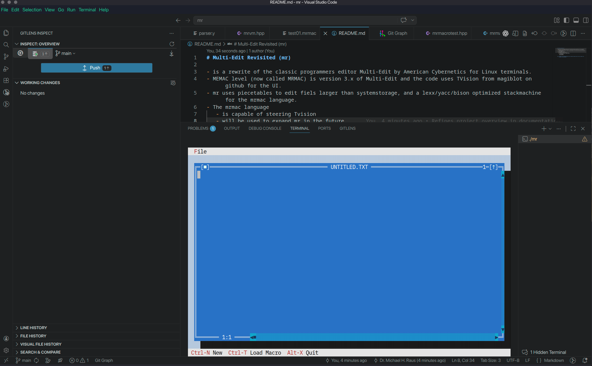
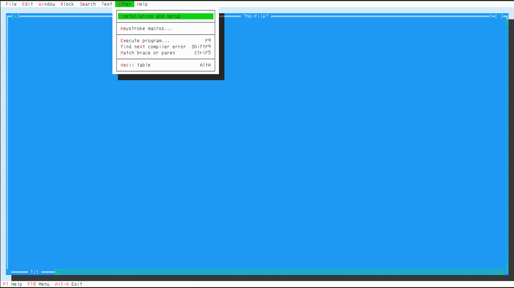
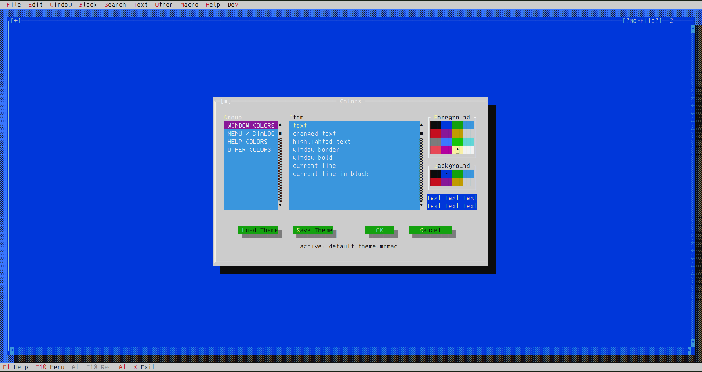

> [!NOTE]
> - "I live again." Caleb (Blood)
> - "It is never enough." Frank Cotton (Hellraiser)
> - "C makes it easy to shoot yourself in the foot; C++ makes it harder, but when you do it blows your whole leg off.“ Bjarne Stroustrup
> - „Talk is cheap. Show me the code.“ Linus Torvalds
> - „My main conclusion after spending ten years of my life working on the TeX project is that software is hard. It's harder than anything else I've ever had to do.“ Donald Knuth
> - "Coding makes me horny." Michael 'iDoc' Raus
> - "Software and cathedrals are much the same – first we build them, then we pray." Sam Redwine
> - "There are only two hard things in Computer Science: cache invalidation and naming things." Phil Karlton
> - "Theory is when you know everything but nothing works. Practice is when everything works but no one knows why. In programming, theory and practice are combined: nothing works and no one knows why." Anonymous

# Multi-Edit Revisited (mr) 

- American Cybernetics (makers of Multi-Edit) went out of business in 2020 and stopped development of the TUI version of Multi-Edit years bevor
- mr is a rewrite of the classic programmers editor Multi-Edit by American Cybernetics for Linux terminals
- mr is constructed aroud a macro language processor, that compiles macro files based on the MEMAC script language. Now called MRMAC the language is backwards code compatible towards the MEMAC dialect but renewed and extended for modern systems. The mrmac lexer and parser were contructed by using lexx and bison as the goldstandard tools under UNIX. All is handled in-RAM for maximum speed utilising precompiled and on-demand compiled macro files
- mr uses
  - the Turbo Visison C++ rewrite TVISION from magiblot on GitHub. TVISION can also be steered from mrmac macros - just like it was in the old days with Multi-Edit
  - advanced data processing models like piecetables, addbuffers, tries and more to edit files larger than system memory and provide file I/O with blazing speed: It loads 1 GB text und under one single second und indexes the whole text in under 800 milliseconds (no BS)
  - a build in coprocessor for handling mrmac bytecode macros that can manipulate text in parallel to the user in the same window (no BS). The coprocessor supports running multiple macro jobs in parallel in different windows or multiple macrojobs in one window or both at the same time. Thecoprocessor uses multiple computes lanes in parallel: I/O, COMPUTE, MACRO and MINIMAP
  - ncursesw and is UTF8 capable
- mr supports
  - automated syntax highlighting, code folding and smart indenting for all known programming languages (except the marsian X!/&%/:-P language)
  - a macro manager for recording macros and binding them to hotkeys. You can also create, manage, edit and bind .mrmac files from inside the manager
  - virtual desktops including moving windows between VDs, saving/reloading workspaces and a window manager that can tile and cascade windows per VD
  - recursive multi file search & search and replace
  - full Perl RegEX PCRE2
  - a sub character minimap display of the file content
  - inter window copy & paste and copy & paste with the OS
  - stream block, line blocks and colum blocks including sorting of the marked block
  - an advanced key mapping manager and loadable key mapping to emulate other editors like Emacs, Nano or Wordstar
  - profiles per file extension or group of file extensions: You can setup the handling of code files depending of the code you edit
  - color theme loading and saving from file extension profiles

