# Multi-Edit Revisited (mr)

> - "I live again." Caleb (Blood)
> - "It is never enough." Frank Cotton (Hellraiser)
> - "C makes it easy to shoot yourself in the foot; C++ makes it harder, but when you do it blows your whole leg off." Bjarne Stroustrup
> - "Talk is cheap. Show me the code." Linus Torvalds
> - "My main conclusion after spending ten years of my life working on the TeX project is that software is hard. It's harder than anything else I've ever had to do." Donald Knuth
> - "Coding makes me horny." Michael 'iDoc' Raus
> - "Software and cathedrals are much the same – first we build them, then we pray." Sam Redwine
> - "There are only two hard things in Computer Science: cache invalidation and naming things." Phil Karlton
> - "Theory is when you know everything but nothing works. Practice is when everything works but no one knows why. In programming, theory and practice are combined: nothing works and no one knows why." Anonymous
> - "Everyone knows that debugging is twice as hard as writing a program in the first place. So if you're as clever as you can be when you write it, how will you ever debug it?" Brian W. Kernighan
> - "Software is getting slower more rapidly than hardware becomes faster." Niklaus Wirth
> - "Code never lies; comments sometimes do." Ron Jeffries
> - "Software is a gas. It expands to fit the container it's in." Nathan Myhrvold
> - "The three chief virtues of a programmer are: Laziness, Impatience and Hubris." Larry Wall

## Look at the size of that thing!

- American Cybernetics (makers of Multi-Edit) went out of business in 2020 and stopped development of the TUI version of Multi-Edit years bevor
- mr is a rewrite of the classic programmers editor Multi-Edit by American Cybernetics for Linux terminals
- mr is constructed aroud a macro language processor, that compiles macro files based on the MEMAC script language. Now called MRMAC the language is backwards code compatible towards the MEMAC dialect but renewed and extended for modern systems. Compilation happens in-RAM through the custom mrmac compiler and supports both precompiled and on-demand compiled macro files for maximum speed. See screenshot: mr is running a utility calculator written in MRMAC
- mr uses
  - the Turbo Vision C++ rewrite TVISION from magiblot on GitHub.
  - advanced data processing models like piecetables, addbuffers, tries and more to edit files larger than system memory and provide file I/O with blazing speed: It loads 1 GB text und under one single second und indexes the whole text in under 800 milliseconds (no BS)
  - a build in coprocessor for handling mrmac bytecode macros that can manipulate text in parallel to the user in the same window. The coprocessor supports running multiple macro jobs in parallel in different windows or multiple macrojobs in one window or both at the same time. The coprocessor uses multiple computes lanes in parallel: I/O, COMPUTE, MACRO and MINIMAP
  - a build in virtual machine to execute its macro language MRMAC in automated precompiled bytestream form
  - ncursesw and is UTF8 capable
- mr supports
  - automated syntax highlighting, code folding and smart indenting for all known programming languages
  - a macro manager for recording macros and binding them to hotkeys. You can create, manage, edit and bind .mrmac files from inside the manager
  - virtual desktops
  - workspaces: Loading, saving, autoloading,autosaving, workspace-wide multifile search & replace.
  - a window manager that can tile, minimize, cascade, close, hide/unhide, save and discard  windows
  - recursive multi file search & multi file search and replace
  - full Perl regex PCRE2
  - a sub character minimap display
  - inter window copy & paste and copy & paste with the OS
  - stream block, line blocks and colum blocks including sorting of the marked block
  - a key mapping manager and loadable key mapping to emulate other stateless editors like Emacs, Nano or WordStar
  - profiles per file extension or group of file extensions: You can setup the handling of code files depending of the code you edit
  - color theme loading and saving from file extension profiles
  - automatic language detection with syntax highlighting
  - automatic multi-level graphical code folding
  - smart indenting and undenting
  - Myers file compare with colored hunks and bi-directional edit function
  - internal git changes display
  - printing via PDF exports
  - line drawing inside your documents with boxes and single and double line auto connecting drawing
  - acquire files from the output of shell commands or pipes
  - compiler profiles with automatic setup and error tracking in code
  - GDB integration for many languages with visual debugging inside mr including stepping, variable mutation, watches, integrated ANSI/VT terminal and more
  - coding snippets
  - hex editors with synchonous hex, dec, oct, strings and binary view plus additional data inspector
  - a vast range of configuration options for your UX
  - and many, many more features

## Why? Who needs this?

- noone needs this - there are many good TUI editors out there
- everybody needs this - because none of the console editors around are this elegant and feature rich. Mr tries to be around in every situation you're in need of a TUI editor to manage your system, files and codebases or want an editor with IDE features in your terminal
- why you ask? I always wanted Multi-Edit back - but only the TUI version inspired me back in the days. I had ideas for this project for years and after i retired in 2024 i had time to export all of these ideas out of my head and into code. I wanted to test what all the fuzz is about with AI and coding assistants - except I was and am not interested in vibe coding, I wanted assistance for the tedious parts. Tried several coding assistants and found Codex to best meet my needs and style of interacting

## Showtime

<table>
  <tr>
    <td width="50%">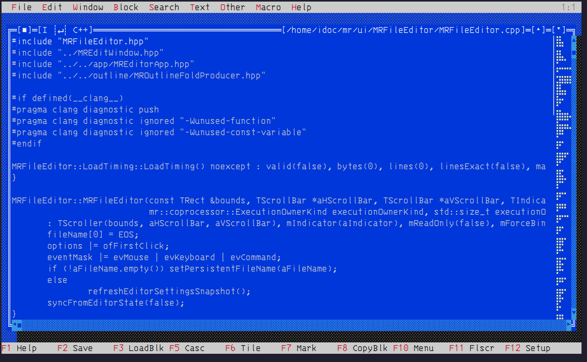</td>
    <td width="50%">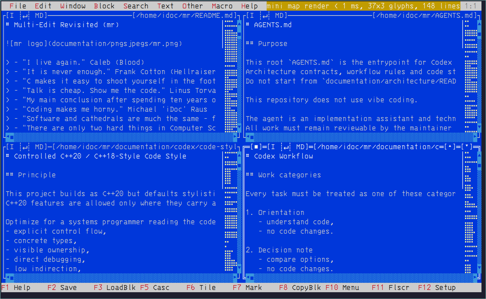</td>
  </tr>
  <tr>
    <td width="50%">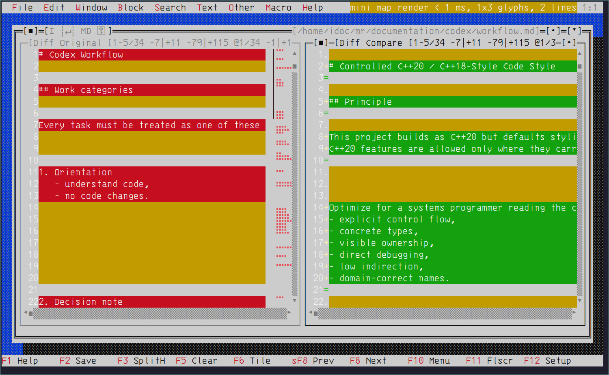</td>
    <td width="50%">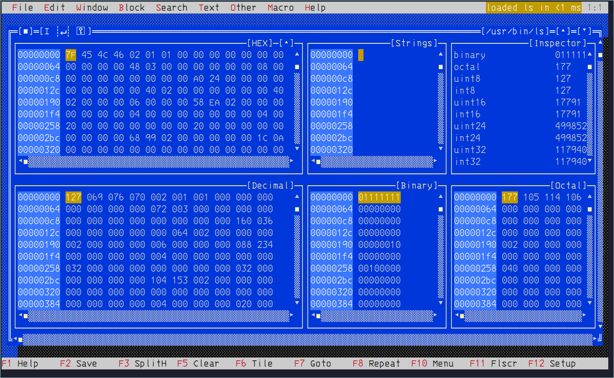</td>
  </tr>
  <tr>
    <td width="50%">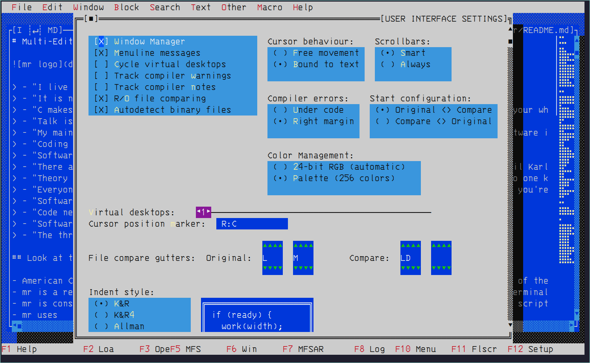</td>
    <td width="50%">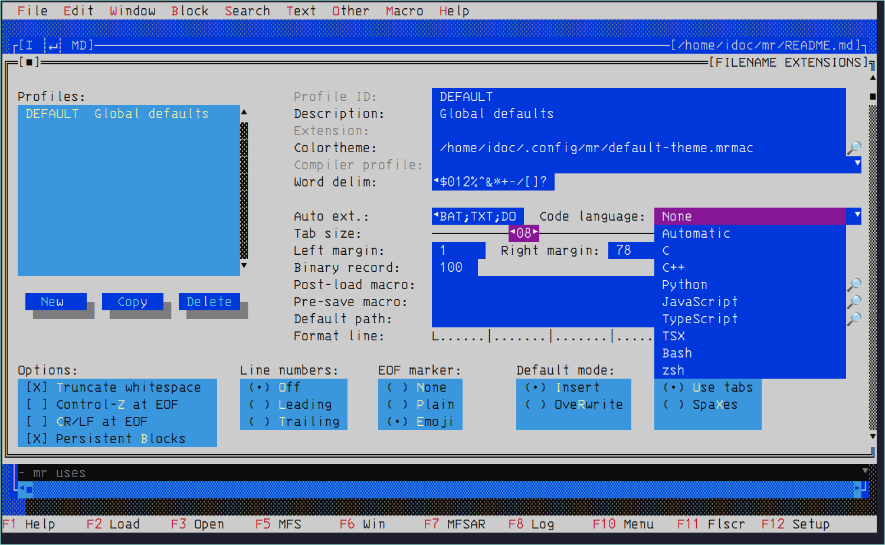</td>
  </tr>
  <tr>
    <td width="50%">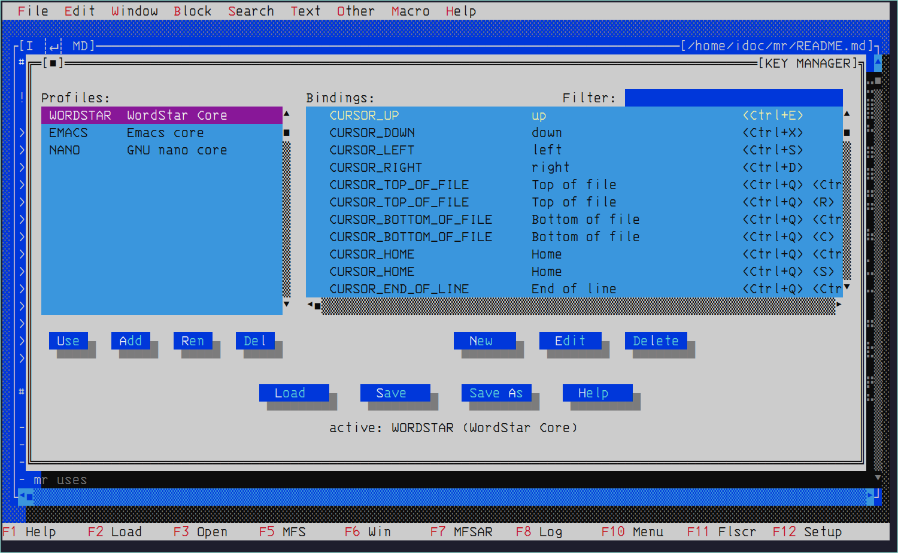</td>
    <td width="50%">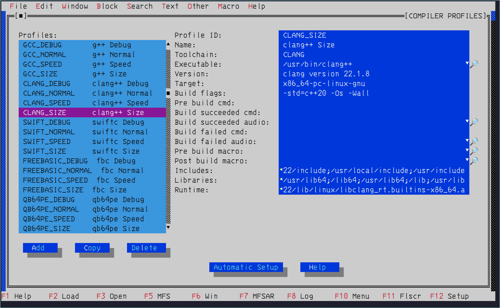</td>
  </tr>
  <tr>
    <td width="50%">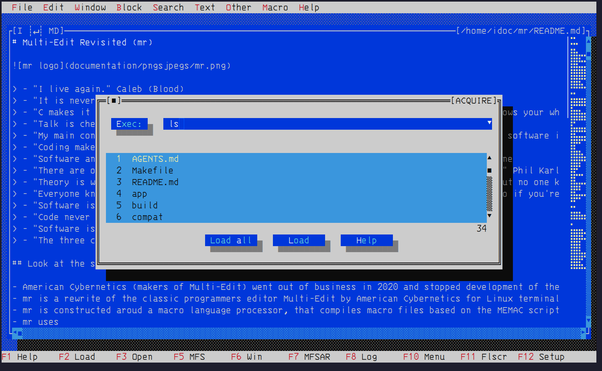</td>
    <td width="50%">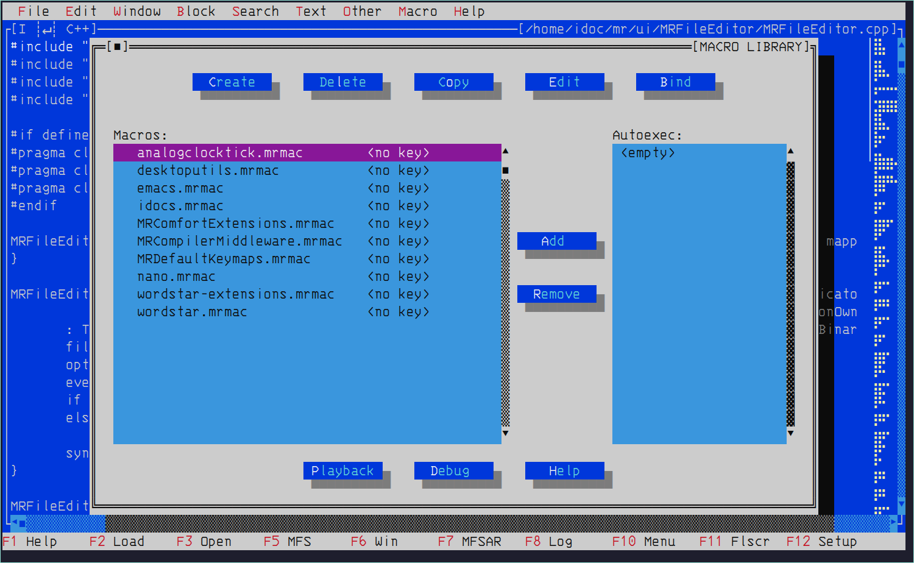</td>
  </tr>
  <tr>
    <td width="50%">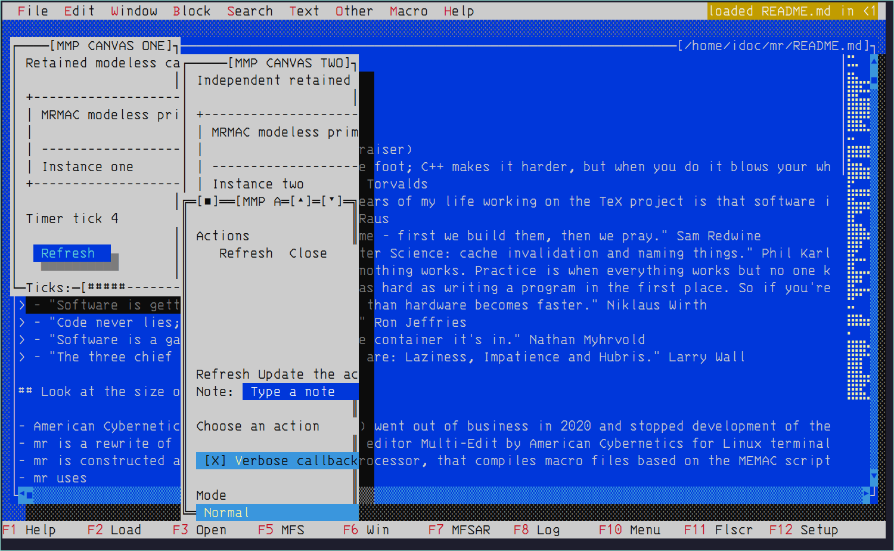</td>
    <td width="50%">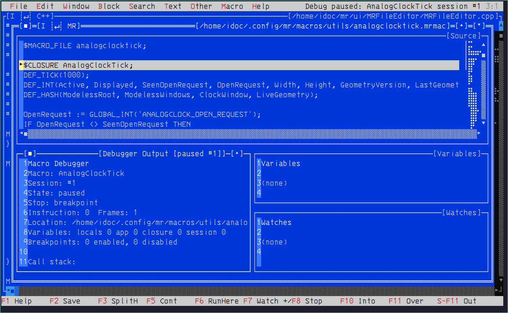</td>
  </tr>
  <tr>
    <td width="50%">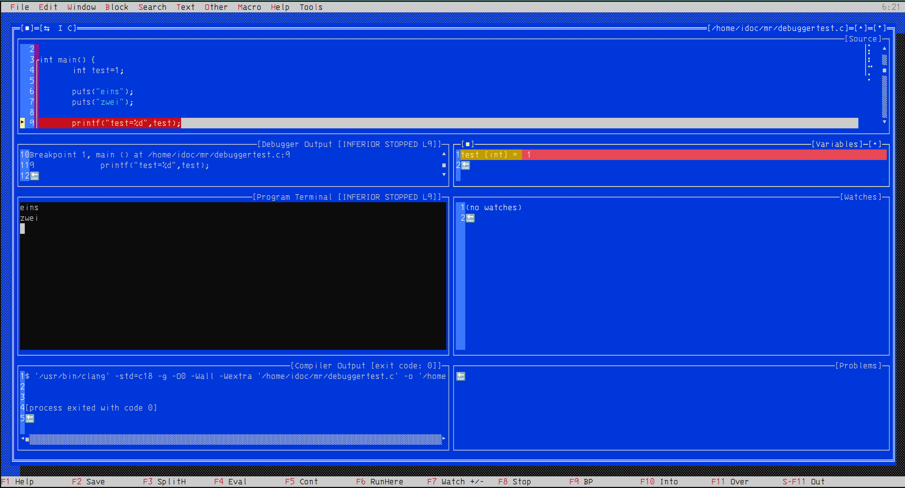</td>

  </tr>
</table>
