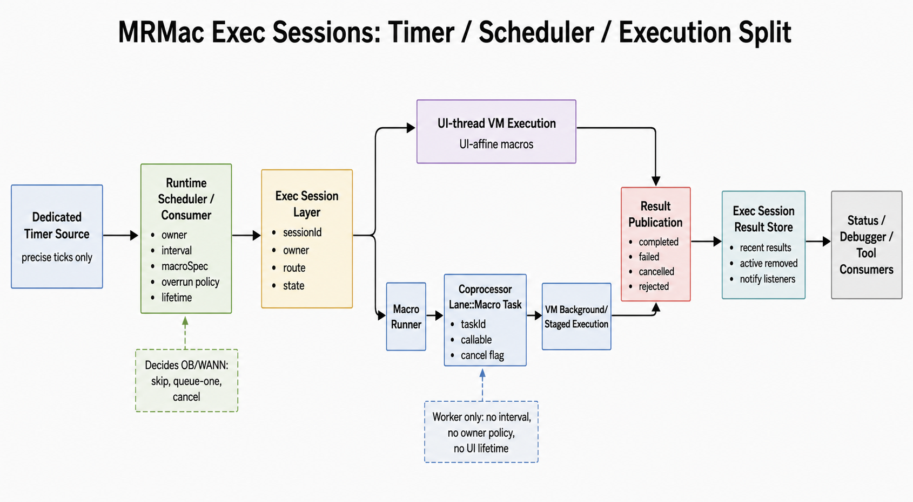

# MRMac Execution Session Contract

## Scope

Applies to MRMac execution-session lifetime and consumers, including:

- `mrmac/MRMacroExecutionSession.*`
- `mrmac/MRMacroRunner.cpp`
- `mrmac/MRMacroRunner.hpp`
- `mrmac/MRVM.cpp`
- `mrmac/MRVM.hpp`
- `mrmac/vm/MRVMExecSessions.*`
- `mrmac/MRVMDebugSession.*`
- `app/MRRuntimeScheduler.*`
- `coprocessor/MRCoprocessor.*`
- `coprocessor/MRCoprocessorDispatch.*`
- foreground macro delay pumping
- background and staged macro result routing
- debugger, timer, event-handler and modeless UI consumers of macro execution

## Authority

The VM owns bytecode execution semantics.

The VM global hash store is the central runtime K/V store for MRMac runtime
state. Top-level K/V roots such as `EXECSESSIONS` are authoritative runtime
state roots, not mirrors of independent C++ registries.

An MRMac execution session owns execution lifetime, ownership metadata, routing,
cancellation, yield/resume state and result publication for one logical macro
execution.

The coprocessor owns background task scheduling and completion delivery.
Deferred macro UI playback owns deferred UI command ordering and application.

Consumers such as the MRMac debugger, timers, event callbacks and modeless tools
must consume execution sessions. They must not create parallel macro runners or
side channels into VM state.

## Terms

An execution session is a typed runtime object for one logical macro execution.
It may be backed by:

- foreground UI-thread execution,
- foreground execution suspended on cooperative `DELAY`,
- background-safe `Lane::Macro` execution,
- staged background execution with existing commit and deferred playback,
- debug execution with a session-owned parked VM handle.

An execution result is the typed completion record of a session. It may report
completion, cancellation, failure, VM log lines, staged edits, deferred UI
commands or debugger status according to the selected route.

An execution owner identifies the UI/runtime owner of a session, such as a
buffer id, window role or later debugger session id. Ownership is for routing
and lifetime checks. It is not a persistence identity.

A closure unit is an MRMac source unit declared with `$CLOSURE`. A closure unit
is scheduled runtime code, not a debugger concept and not a second macro
frontend.

## Runtime Split

The following diagram summarizes the intended split between timer sources,
runtime consumers, execution sessions, macro routing and coprocessor work items.



## Invariants

- Normal compiler, bytecode and VM semantics remain governed by the
  [MRMAC Language / Compiler contract](mrmac-language-contract.md).
- Exec sessions must reuse the existing route classification from
  `MRMacroExecutionProfile` unless a dedicated architecture decision changes it.
- Exec sessions must reuse `Lane::Macro` for background macro work unless a
  dedicated architecture decision adds a lane.
- Deferred UI ordering, batching and rendering remain governed by the
  [Coprocessor / Deferred UI contract](coprocessor-deferred-ui-contract.md).
- Settings and workspace persistence remain governed by the settings
  contracts.
- Exec sessions must not change deferred UI playback ordering or batching.
- Exec sessions must not add direct TVision screen writes.
- Exec sessions must not add new settings or workspace persistence. The
  debugger's separately approved cold Bento configuration is not execution
  session persistence: it contains no session id, route, task, VM state or
  result.
- Exec session state is runtime state. It must not be serialized through
  `settings.mrmac` or workspace files without a dedicated persistence decision.
- Exec-session runtime state is stored in the central VM K/V hash under the
  top-level key `EXECSESSIONS`.
- `runtime-only` means that this state is not serialized. It does not permit a
  second value-bearing C++ registry beside the central VM K/V store.
- C++ snapshots of `EXECSESSIONS` data are transfer objects rebuilt from the
  K/V store. C++ may retain only mechanical handles that VM values cannot
  represent, including callback pointers and suspended `VirtualMachine`
  ownership.
- Closure variable state, active session metadata, recent terminal results,
  foreground `DELAY` metadata, session-persistent `DEF_*` variables, scheduler
  consumers, scheduler events, status generations and listener ids belong under
  `EXECSESSIONS`.
- `EXECSESSIONS` data must be grouped by runtime role:
  - `EXECSESSIONS/counters/*` for runtime id counters,
  - `EXECSESSIONS/status/generation` for status generation,
  - `EXECSESSIONS/sessions/active/byTask/<taskId>` for active sessions,
  - `EXECSESSIONS/sessions/pending/foregroundDelay/<sessionId>` for foreground
    `DELAY` sessions,
  - `EXECSESSIONS/sessions/byId/<sessionId>/variables/byName/<variableName>`
    for variables declared by `DEF_*` in a long-lived execution session,
  - `EXECSESSIONS/results/recent/<resultId>` for recent terminal results,
  - `EXECSESSIONS/listeners/registered/<listenerId>` for listener ids,
  - `EXECSESSIONS/scheduler/consumers/<consumerId>` for scheduler consumers,
  - `EXECSESSIONS/scheduler/events/recent/<eventId>` for scheduler events,
  - `EXECSESSIONS/scheduler/nextPumpMs` for the next scheduler pump deadline,
  - `EXECSESSIONS/closures/<closureId>/state/<variableName>` for closure
    variable state,
  - `EXECSESSIONS/console/*` for execution-session console state.
  New runtime data must be placed under a meaningful branch instead of adding
  flat siblings directly below `EXECSESSIONS`.
- Exec sessions must not add a second closure registry, a second scheduler
  registry or a second persistence store.
- `MRSETUP` and `SAVE_SETTINGS` behavior must remain governed by the VM and
  settings contracts.
- Cancellation and pause are cooperative. A session must not interrupt execution
  in the middle of a C++ intrinsic, external I/O operation or deferred UI
  playback application.
- `DELAY` remains a cooperative yield point. Generalizing foreground pending
  delay into session state must preserve existing async delay semantics.

## Consumer Rule

The MRMac debugger is a consumer of execution sessions.

Debugger-specific concepts such as source maps, breakpoints, step mode,
variable snapshots and source-location projection must be layered on top of
execution sessions. They must not be mixed into the base session contract unless
they are represented as optional typed session capabilities or results.

The debugger must be able to inspect macro-visible runtime state through the
central K/V roots. It must not require private C++ registries for values that
are representable as VM scalar, string, array or hash data. Relevant roots
include `MACROGLOBALS`, `EXECSESSIONS`, `MACROCATALOG` and other approved
macro-visible runtime roots.

Modeless MRMac UI, timers and event callbacks are also consumers of execution
sessions. They may request execution, cancellation or status, but they do not
own VM internals.

A debug start must reuse the same bytecode profile and natural route selection
as normal execution. Background-safe bytecode resumes as finite
`Lane::Macro` work; staged bytecode reuses the normal captured input, conflict
snapshot, staged transaction, commit gate and deferred playback; remaining
UI-affine bytecode advances through bounded UI-pump budgets. A pause or
breakpoint parks the VM as a mechanical session handle and releases any worker.
Continue and step create a new finite worker lifetime only for worker routes.
Each such lifetime publishes its current task id under
`EXECSESSIONS/sessions/active/byTask/<taskId>` before execution and removes
that entry when the result is adopted, before another finite worker is
scheduled for the same parked debug session.
Pause and cancellation remain cooperative and must be requestable without
waiting for the executing worker to release the VM execution lock.

A modeless control callback must request its target macro through an execution
session. It must not execute a macro directly from a TVision event handler.
The execution owner may name one modeless window id; that identity is runtime
only and scopes lifecycle, status and later cancellation without becoming a
persistence identity.

## Session Variables

`DEF_*` declarations in a normal finite macro execution create VM-local
variables for that execution. They are not file-wide globals.

When an execution session can outlive a single immediate stack execution, its
declared `DEF_*` variables are session runtime state. They must be represented
under:

```text
EXECSESSIONS/sessions/byId/<sessionId>/variables/byName/<variableName>
```

This state is owned by the execution session lifecycle. Removing the session
removes its variables. A later session that executes the same macro source must
not inherit variables through the source file path or macro file identity.

Session variables must not be stored in `MACROGLOBALS`. `MACROGLOBALS` is only
for explicit MRMac globals addressed through the global language procedures and
intrinsics.

## Closure Units

The first closure syntax is:

```mrmac
$CLOSURE Name;
DEF_TICK(1000);
DEF_INT(Counter);
Counter := Counter + 1;
END_CLOSURE;
```

`DEF_TICK` declares the scheduler interval in milliseconds. It is runtime
metadata, not bytecode.

The compiler records closure units as compiled MRMac units with an entry offset,
unit kind and tick interval. It must not introduce new opcodes for this tranche.

The runner starts a closure unit through `VirtualMachine::executeAt` using the
recorded entry offset. The scheduler may carry source text plus entry name as a
runtime package, but it must not compile, cache or inject bytecode itself.

Closure variables declared by `DEF_*` are loaded from:

```text
EXECSESSIONS/closures/<closureId>/state/<variableName>
```

On assignment, declared closure variables are written back to the same state
hash. If the closure id or state entry is absent, the VM falls back to the normal
default value for the declared type. If a later asynchronous result cannot find
the closure state for its lvalue, the result must be discarded rather than
reviving expired closure state.

Closure variable lifetime is bounded by the execution-session lifecycle that
owns the closure. Invalidating the owning session invalidates the closure unit,
its timer or callback registration and all closure variable state. No closure
state may be kept alive in a C++ side registry after the owning session or its
`EXECSESSIONS` K/V subtree has been removed.

The initial closure id is the runtime macro spec that identifies the loaded
closure, for example:

```text
path/to/file.mrmac^ClockTick
```

This id is a runtime K/V key. It is not a persisted object identity.

## Exec UI Commands

MRMac may request a UI-affine command from a closure with assignment syntax:

```mrmac
Result := EXEC('ACTIVE', 'TEXT_END');
```

`EXEC` returns an integer success code. `1` means the UI command was accepted and
executed; `0` means the target or command was not accepted.

`EXEC` is not a normal expression intrinsic. The compiler treats
`lvalue := EXEC(target, command)` as a special assignment form so the lvalue is
known to the VM. The first implementation supports only integer lvalues.

In a UI-thread macro, `EXEC` may execute immediately through the existing
command router and write the lvalue directly.

In a background execution session, `EXEC` must not touch TVision or editor state
directly. The worker records a typed UI-command request. The UI result pump later
applies the request on the UI thread and writes the success code back to:

```text
EXECSESSIONS/closures/<closureId>/state/<lvalue>
```

If the closure id or lvalue state is gone, the result is discarded. The result
must not recreate expired closure lifetime.

The first target contract is conservative:

- empty target or `ACTIVE`: current effective editor window,
- `BUFFER:<id>`: editor window with that buffer id.

The command string is normalized through the existing keymap/action command
surface. The first compatibility aliases include `TEXT_END`, `EOF`,
`TEXT_START`, `TOF`, `LINE_END`, `EOL`, `LINE_START`, `HOME`, `SCROLL_UP` and
`SCROLL_DOWN`.

## Route Boundaries

Foreground execution may touch live UI state only through existing VM/UI bridge
rules.

Background-safe execution may run on `Lane::Macro` only when the bytecode profile
is background-safe.

Staged execution may run on `Lane::Macro` only through the existing staged input,
staged result, conflict check, commit and deferred playback route.

Debug execution is an execution-session route. A paused debug VM is a
mechanical handle keyed by session id; user-visible debugger state remains
under `MACRODEBUGGER`.

Exec sessions may name these routes and expose status for them. They must not
merge route semantics into a generic path that hides staging, validation,
canonical execution, final apply or rendering.

## Boundaries

Without explicit maintainer approval:

- New macro execution lanes.
- New opcode semantics.
- Bytecode injection APIs that bypass the canonical compiler path.
- Persisting sessions or runtime state in settings/workspace files. A
  debugger Bento may persist its separately approved cold source,
  breakpoint-definition and watch-definition configuration through
  `WORKSPACE`; it must not persist a session, VM, route, task, current
  location, value snapshot or generated source map.
- Direct TVision rendering from sessions or consumers.
- Debugger-only state baked into the base session model.
- Modeless widget or raw TVision binding APIs in the session layer.
- New deferred UI batching boundaries.
- Replacing staged macro conflict checks with session-level shortcuts.
- Single-listener overwrite semantics for execution-session change consumers.

## Listener Lifetime

Execution-session change listeners are runtime-only process state.

Listeners must use stable function-pointer callbacks. A listener that represents
a short-lived consumer must deregister by id before the owning consumer is
destroyed. A process-lifetime consumer may keep its listener registered until
process exit.

Notification must copy the registered callbacks under the listener lock and call
them after releasing that lock. Listener callbacks must not depend on holding
the listener lock.

Only callback pointers and their mutex may remain in C++. Listener ids and the
status generation are authoritative under `EXECSESSIONS`; status consumers
must not mirror either value.

Convenience installers for process-lifetime listeners must be idempotent unless
they explicitly document that repeated registration is intended.

## Status Consumers

Status consumers may build runtime-only snapshots from active sessions, pending
foreground `DELAY` sessions and recent terminal results. They must treat these
snapshots as observation state only.

Status consumers must not introduce debugger concepts, UI rendering contracts or
new macro execution routes. They may format status lines for logs or later UI
surfaces, but they must not mutate VM, editor or coprocessor state.

## Runtime Scheduler

The timer source is a separate runtime component. It supplies monotonic runtime
ticks and must not know macro specs, owners, execution routes or overrun policy.

The runtime scheduler owns scheduled consumer behavior. Its scheduled consumer
metadata such as owner, interval, macro spec or macro source package and
overrun policy is runtime-only state under `EXECSESSIONS` and must not be
serialized.

An MMP timer identifies its consumer with the modeless execution owner and a
logical timer key. The MMP API must never expose the scheduler consumer id.
Closing the modeless window removes all scheduler consumers for that owner
before requesting cooperative cancellation of that owner's active sessions.
An MMP timer callback is explicitly routed by the macro runner to the UI
thread execution path. It remains an execution session, but its dynamic
`RUN_MACRO` launcher must not become a staged background session merely
because an editor has focus.

The scheduler does not execute bytecode directly. When a scheduled tick is
allowed to run, it requests a normal execution session. The macro runner still
owns route classification, and the coprocessor still receives only concrete
work items for background or staged execution.

A scheduled source package must enter through the same compiler path as other
MRMac source text. The scheduler may carry source text as runtime consumer
configuration, but it must not compile, cache or inject bytecode.

When a loaded file contains a closure unit with `DEF_TICK`, the runtime may
register one scheduled consumer for that closure. Reloading or unloading the
file must remove the previous scheduled consumer before installing a replacement.

Skipped ticks must be visible as scheduler events and must be logged. A skipped
tick is not an execution result, because no execution session was created for
that tick. Debugger and status tooling must be able to explain both what ran
from execution-session results and what did not run from scheduler events.

The only approved overrun policy is `skip`: if the previous session for a
scheduled consumer is still active, the next due tick records `TickSkipped` with
the blocking session id. Queueing, coalescing, latest-wins replacement or
parallel overlap require a dedicated architecture decision before implementation.

The scheduler execution hook records `TickDue` and then requests execution
through the normal macro runner. It must record `TickStarted` or
`TickStartFailed` so the debugger can explain both successful dispatch and
dispatch failure.

The scheduler must observe execution-session terminal results and clear the
matching scheduled consumer's active session id. This observation is keyed by
session id, not by macro name. It must record `TickFinished` so status and
debugger consumers can explain when an overrun blocker disappeared.

## Cancellation Requests

Session cancellation requests are cooperative.

A request may mark an active background or staged session as
`CancellationRequested`, but the session remains active until the existing
coprocessor result path publishes a terminal result. Foreground `DELAY`
sessions may be cancelled directly at their cooperative yield point and then
publish `Cancelled`.

Owner-scoped cancellation must match only the explicit owner identity. A buffer
owner must not match ownerless sessions or sessions for another buffer.

## Related contracts

- [MRMAC Language / Compiler](mrmac-language-contract.md)
- [VM / Intrinsics / Deferred UI](vm-deferred-ui-contract.md)
- [Coprocessor Runtime](coprocessor-runtime-contract.md)
- [Coprocessor / Deferred UI](coprocessor-deferred-ui-contract.md)

## Required manual tests

For execution-session code changes, test:

- representative macro compile and run
- foreground UI-thread macro execution
- foreground `DELAY` yield, resume and cancel
- background-safe `Lane::Macro` execution
- staged macro execution, conflict rejection and successful commit
- deferred UI playback ordering and batching
- VM cancellation behavior
- MRSETUP allowed and forbidden contexts if touched
- SAVE_SETTINGS behavior if touched
- relevant regression probes and structure checks
